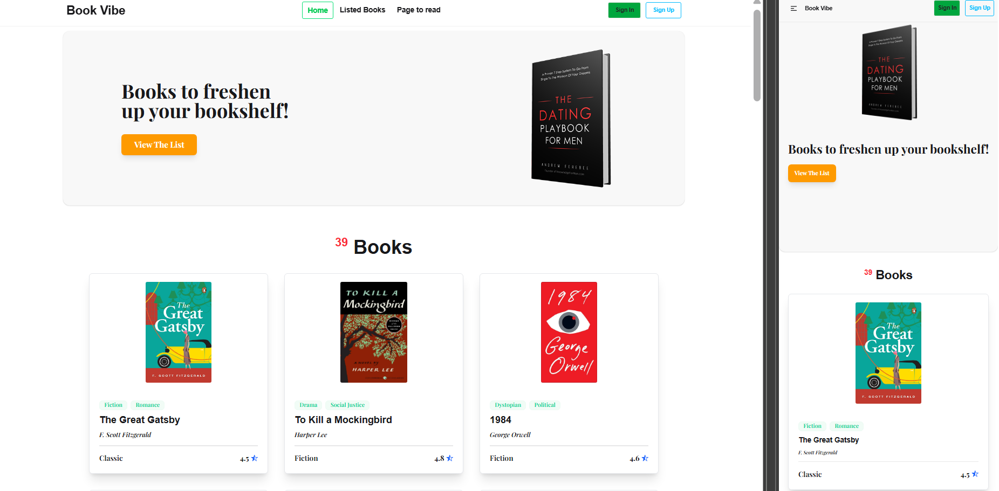
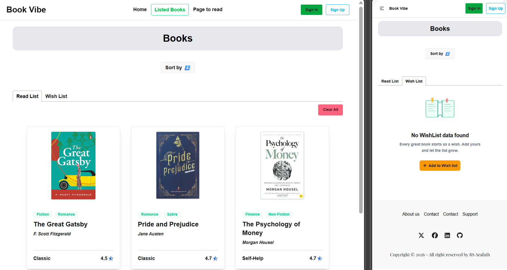
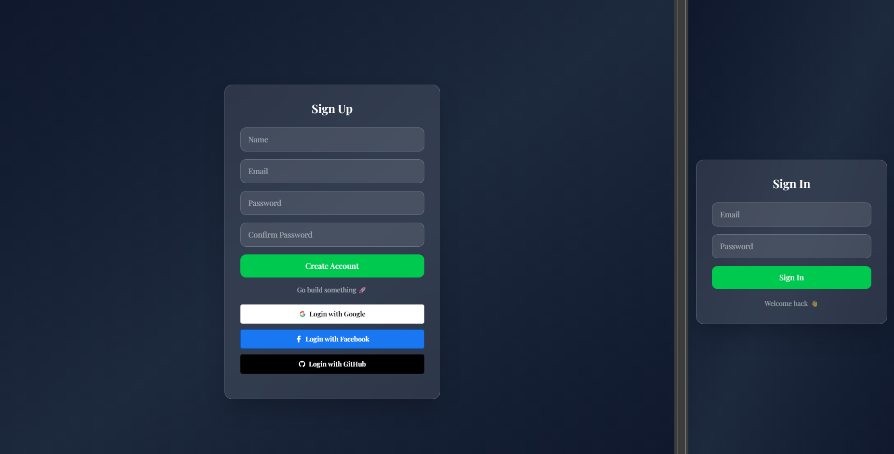

<div align="center">

# 📚 Book Vibe

### _Where Every Page Sparks Joy_

A modern, responsive book discovery web app — explore world-famous books, view
detailed info, and track your personal reading journey.

[](https://book-vibe-bd.vercel.app/)
[](https://github.com/RS-Arafath/world-famous-book.git)


</div>

---

## 🖼️ Preview

### home



### Book Details


### Reading and Wish List



### User Login



---

## ✨ Features

- 📖 **Book Collection** — Browse a curated list of world-famous books across
  multiple genres
- 🔍 **Book Details Page** — View full info: author, category, tags, rating,
  number of pages, publisher, and year
- 📌 **Read List** — Save books you want to read using the browser's
  LocalStorage
- ✅ **Finished List** — Keep track of books you've already completed
- 🚫 **Duplicate Prevention** — Toast notifications alert you when a book is
  already in your list
- 📊 **Reading Stats** — Visual bar chart showing your reading progress by page
  count
- 🔀 **Multi-Page Routing** — Smooth client-side navigation with React Router
  DOM
- ❌ **Custom 404 Page** — Friendly "Not Found" page for invalid routes
- 📱 **Fully Responsive** — Works seamlessly on desktop, tablet, and mobile

---

## 🛠️ Tech Stack

| Category            | Technology                                                                               |
| ------------------- | ---------------------------------------------------------------------------------------- |
| ⚛️ UI Library       | [React.js v18](https://react.dev/)                                                       |
| ⚡ Build Tool       | [Vite](https://vitejs.dev/)                                                              |
| 🎨 Styling          | [Tailwind CSS](https://tailwindcss.com/)                                                 |
| 🧩 UI Components    | [DaisyUI](https://daisyui.com/)                                                          |
| 🔁 Routing          | [React Router DOM v6](https://reactrouter.com/)                                          |
| 📊 Charts           | [Recharts](https://recharts.org/)                                                        |
| 🔔 Notifications    | [React Toastify](https://fkhadra.github.io/react-toastify/)                              |
| 💾 Data Persistence | [LocalStorage API](https://developer.mozilla.org/en-US/docs/Web/API/Window/localStorage) |
| 🚀 Deployment       | [Vercel](https://vercel.com/)                                                            |

---

## 📦 Dependencies

```json
{
  "dependencies": {
    "react": "^18.x",
    "react-dom": "^18.x",
    "react-router-dom": "^6.x",
    "recharts": "^2.x",
    "react-toastify": "^10.x"
  },
  "devDependencies": {
    "vite": "^5.x",
    "@vitejs/plugin-react": "^4.x",
    "tailwindcss": "^3.x",
    "daisyui": "^4.x",
    "postcss": "^8.x",
    "autoprefixer": "^10.x",
    "eslint": "^8.x"
  }
}
```

---

## 📁 Project Structure

```
world-famous-book/
├── public/
│   └── json data
├── src/
│   ├── assets/               # Static images
│   ├── components/
│   │   ├── Navbar/           # Navigation bar
│   │   ├── Banner/           # Hero/banner section
│   │   ├── BookCard/         # Individual book card
│   │   ├── BookDetails/      # Book detail modal/page
│   │   └── Footer/           # Footer component
│   ├── pages/
│   │   ├── Home/             # Home page — book listing
│   │   ├── ListedBooks/      # Read list & finished list tabs
│   │   ├── PagesToRead/      # Reading stats with bar chart
│   │   └── NotFound/         # Custom 404 page
│   ├── utils/
│   │   └── localStorage.js   # LocalStorage helper functions
│   ├── App.jsx               # Root component & route config
│   └── main.jsx              # Entry point
├── index.html
├── tailwind.config.js
├── vite.config.js
└── package.json
```

---

## 🚀 Getting Started

### Prerequisites

- [Node.js](https://nodejs.org/) v18 or higher
- [npm](https://www.npmjs.com/) or [yarn](https://yarnpkg.com/)

### Installation

```bash
# 1. Clone the repository
git clone https://github.com/RS-Arafath/world-famous-book.git

# 2. Move into the project folder
cd world-famous-book

# 3. Install all dependencies
npm install

# 4. Start the dev server
npm run dev
```

Open your browser at **http://localhost:5173**

### Build for Production

```bash
npm run build
```

---

## 🌐 Live Demo

👉 **[https://book-vibe-bd.vercel.app/](https://book-vibe-bd.vercel.app/)**

---

## 📸 Pages Overview

| Page          | Route            | Description                            |
| ------------- | ---------------- | -------------------------------------- |
| Home          | `/`              | Browse the full book collection        |
| Book Details  | `/book/:id`      | View detailed info for a specific book |
| Listed Books  | `/listed-books`  | Your read & finished book lists        |
| Pages to Read | `/pages-to-read` | Bar chart of your reading stats        |
| 404 Not Found | `*`              | Custom error page for invalid routes   |

---

## 🤝 Contributing

Contributions are welcome!

1. Fork the repository
2. Create a new branch: `git checkout -b feature/your-feature`
3. Commit your changes: `git commit -m "Add: your feature description"`
4. Push to the branch: `git push origin feature/your-feature`
5. Open a Pull Request

---

<div align="center">

# 👨‍💻 Author
## **RS Arafath**

[](https://github.com/RS-Arafath)

---

## 📄 License

This project is open source and available under the [MIT License](LICENSE).

---

</div>
<div align="center">
  Made with ❤️ by <a href="https://github.com/RS-Arafath">RS Arafath</a>
</div>
